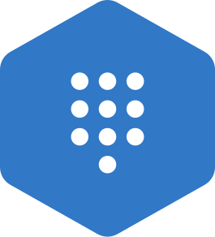

<p align="center">

</p>
<h1 align="center">
<sup>Node Vault</sup>
<br>
<a href="https://github.com/shahradelahi/node-vault/actions/workflows/ci.yml" title="Build status"></a>
<a href="https://www.npmjs.com/package/@litehex/node-vault" title="NPM Version"></a>
<a href="https://www.npmjs.com/package/@litehex/node-vault" title="Downloads"></a>
<a href="https://opensource.org/licenses/MIT" title="License"></a>
</h1>

_node-vault_ is a Javascript HTTP client for [HashiCorp's Vault](https://developer.hashicorp.com/vault/api-docs) API
that allows you to have typesafe access to the API using [TypeScript](https://www.typescriptlang.org/)
and [Zod](https://github.com/colinhacks/zod).

---

- [Features](#-features)
- [Installation](#-installation)
- [Usage](#-usage)
  - [Init and unseal vault](#init-and-unseal-vault)
  - [Create Key/Value V2 engine](#create-keyvalue-v2-engine)
  - [Create, read, update, delete secrets](#write-read-and-delete-secrets)
  - [Transit Secrets Engine](#transit-secrets-engine)
- [Documentation](#-documentation)
- [Contributing](#-contributing)
- [License](#license)

## 👀 Features

- Simple API
- Typesafe and Validated Requests from Zod
- Extendable using Custom Commands

## 📦 Installation

```bash
npm install @litehex/node-vault
```

## 📖 Usage

##### Init and unseal vault

```typescript
import { Client } from '@litehex/node-vault';

// Get a new instance of the client
const vc = new Client({
  apiVersion: 'v1', // default
  endpoint: 'http://127.0.0.1:8200', // default
  token: 'hv.xxxxxxxxxxxxxxxxxxxxx' // Optional in case you want to initialize the vault
});

// Init vault
const init = await vc.init({ secret_shares: 1, secret_threshold: 1 });
console.log(init); // { data: { keys: [ ... ], keys_base64: [ ... ], ... } }

// Set token
const { keys, root_token } = init;
vc.token = root_token;

const unsealed = await vc.unseal({ key: keys[0] });

console.log(unsealed); // { data: { type: 'shamir', initialized: true, sealed: false, ... } }
```

##### Create Key/Value V2 engine

```typescript
const mounted = await vc.mount({
  mountPath: 'my-secret',
  type: 'kv-v2'
});

console.log(mounted); // { data: true }

const info = await vc.engineInfo({ mountPath: 'my-secret' });

console.log(info); // { data: { type: 'kv', options: { version: '2' }, ... } }
```

##### Write, read and delete secrets

```typescript
const mountPath = 'my-secret';
const path = 'hello';

const write = await vc.kv2.write({
  mountPath,
  path,
  data: { foo: 'bar' }
});
console.log(write); // { data: { request_id: '...', lease_id: '...', ... } }

const read = await vc.kv2.read({ mountPath, path });
console.log(read); // { data: { request_id: '...', lease_id: '...', ... } }

const deleted = await vc.kv2.deleteLatest({ mountPath, path });
console.log(deleted); // { data: true }
```

##### Transit Secrets Engine

```typescript
// Enable Transit engine
const enabled = await vc.transit.enable({
  mountPath: 'transit',
  type: 'transit',
  description: 'Transit secrets engine'
});

// Create encryption key
const keyCreated = await vc.transit.createKey({
  mountPath: 'transit',
  name: 'my-key',
  type: 'aes256-gcm96',
  // Avoid exportable keys in production. Use true only if you must export material.
  exportable: false
});
// Encrypt data
const plaintext = Buffer.from('Hello, World!').toString('base64');
const encrypted = await vc.transit.encrypt({
  mountPath: 'transit',
  name: 'my-key',
  plaintext
});
console.log(encrypted.data.ciphertext); // vault:v1:...

// Decrypt data
const decrypted = await vc.transit.decrypt({
  mountPath: 'transit',
  name: 'my-key',
  ciphertext: encrypted.data.ciphertext!
});
console.log(Buffer.from(decrypted.data.plaintext!, 'base64').toString()); // Hello, World!

// Generate data key
const dataKey = await vc.transit.generateDataKey({
  mountPath: 'transit',
  name: 'my-key',
  type: 'wrapped',
  bits: 256
});
console.log(dataKey.data.ciphertext); // vault:v1:...

// Sign data
const input = Buffer.from('Hello, World!').toString('base64');
const signed = await vc.transit.sign({
  mountPath: 'transit',
  name: 'my-key',
  input
});
console.log(signed.data.signature); // vault:v1:...

// Verify signature
const verified = await vc.transit.verify({
  mountPath: 'transit',
  name: 'my-key',
  algorithm: 'ed25519',
  input,
  signature: signed.data.signature!
});
console.log(verified.data.valid); // true

// Rotate key
const rotated = await vc.transit.rotateKey({
  mountPath: 'transit',
  name: 'my-key'
});

// Export key (if exportable)
const exported = await vc.transit.exportKey({
  mountPath: 'transit',
  name: 'my-key',
  type: 'encryption-key'
});
console.log(exported.data.keys); // { "1": "..." }

// Backup and restore key
const backup = await vc.transit.backupKey({
  mountPath: 'transit',
  name: 'my-key'
});

const restored = await vc.transit.restoreKey({
  mountPath: 'transit',
  name: 'my-key-restored',
  backup: backup.data.backup
});
```

### 📚 Documentation

For complete usages, please dive into the [Wiki](https://github.com/shahradelahi/node-vault/wiki).

For all configuration options, please see [the API docs](https://www.jsdocs.io/package/@litehex/node-vault).

### 🤝 Contributing

You can contribute to this project by opening an issue or a pull request
on [GitHub](https://github.com/shahradelahi/node-vault). Feel free to contribute, we care about your ideas and
suggestions.

### Relevant

- HashiCorp's Vault [API docs](https://developer.hashicorp.com/vault/api-docs)
- [Minimal CLI for K/V V2 engine](https://github.com/shahradelahi/vault-cli)

### License

[MIT](/LICENSE) © [Shahrad Elahi](https://github.com/shahradelahi) and [contributors](https://github.com/shahradelahi/node-vault/graphs/contributors).
